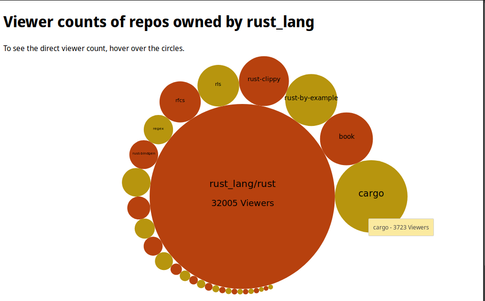

# et-vis

Data gathering and visualisation assignment for CS3012.

The visualisation is in two stages - a Rust program that polls the GitHub V3 API and proceeds to fill the database, and a Ruby on Rails instance that creates a server which hosts a webpage with the visualisation

### Requirements:

* Rust/Cargo
* MySQL
* Ruby, Ruby on Rails

Details used by the Rust program for API collection, such as the API token and MySQL user & password,
are stored in a file `DETAILS` in the root directory in the project, With the layout of the file given by `DETAILS.example`.

For Ruby on Rails, the database details need to be inserted in `et-vis/config/database.yml`

As it currently stands, the database expects a database `et-vis`, containing a table `et_vis_graph`.
Instructions on how to get the table's schema should be defined here at a later point. 

## Example output

## Operation

A helper script should be added at a later point.

1. Ensure that `DETAILS`, Rails database details and the MySQL database are fully set up.
2. Go into `/ghdata` and run `cargo run`
3. Go into `/et-vis` and run `rails server`
4. Connect to the server at `localhost:3000`

## Comments & Notes

My initial plan for using Rust was to attempt to implement a heavier data collection task than is currently used.
However, there was only one valid library for making calls to the GitHub V3 API, witht he only alternative
being writing my own connection code. The library is quite incomplete and is missing some (quite important) features
that would allow more complicated and extensive tasks and data collection over the API, and as such I had to rescale the
scope of my project, while keeping the same architecture.

However, I am quite satisfied in the circle effect I achieved in the visualisation itself,
which however would require extra consider over much larger data sets, which due to the above I am unable to work with
